# Color Generator

## Description
A python backend to generate colors.
This can be used for any kind of UI design and can continuously generate colors quickly.

## Adding a Color Theme

By including the optional color theme parameter, 
the generated colors would follow the tone of the theme color.
This can be useful for creating a UI with a specific color style.

1. A random palette of colors with no given theme.
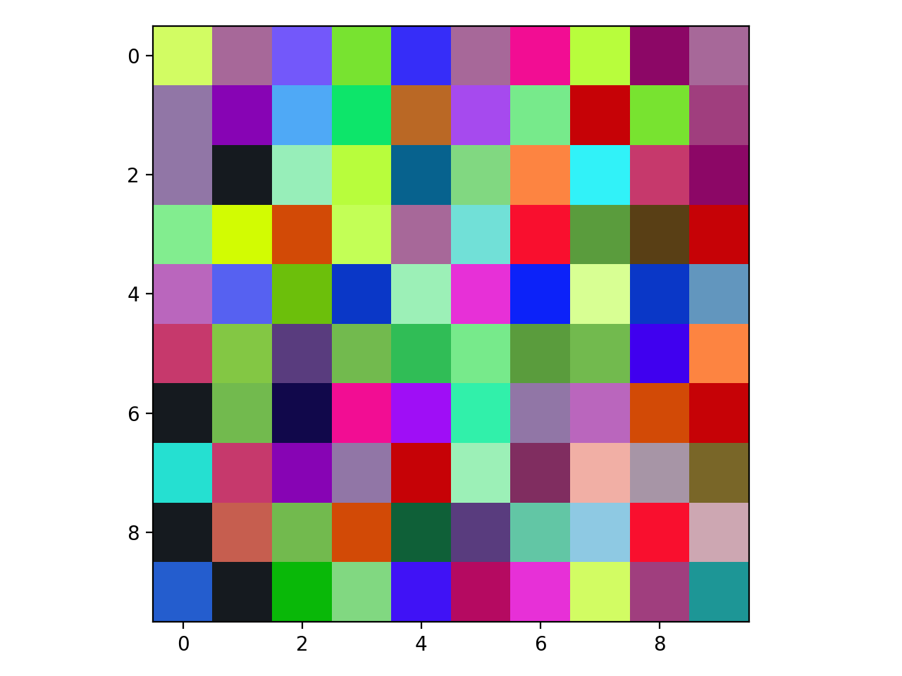

2. A color palette with the white theme (pastel colors)

3. A color palette with the grey theme (darker pastel colors)
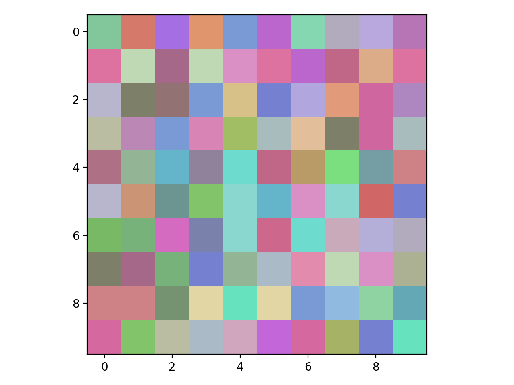

4. A color palette with the red theme
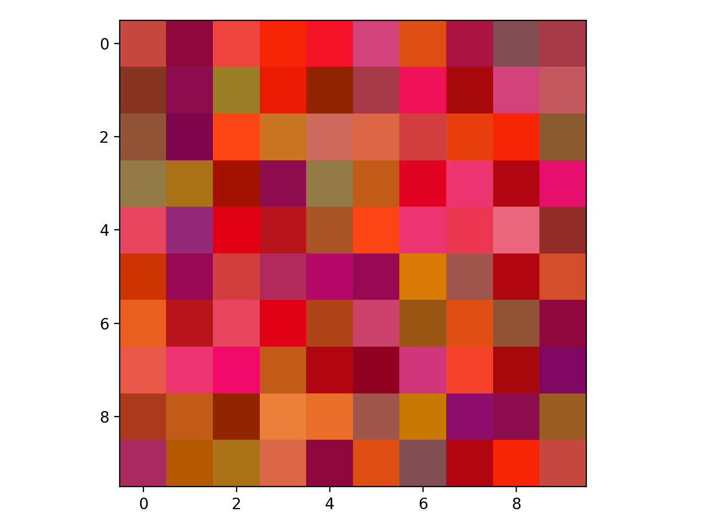

5. A color palette with the green theme
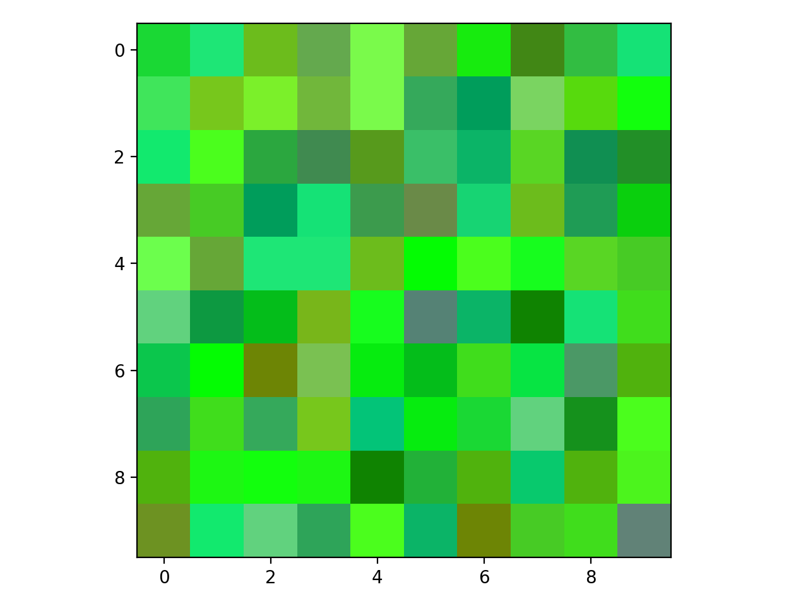

6. A color palette with the blue theme
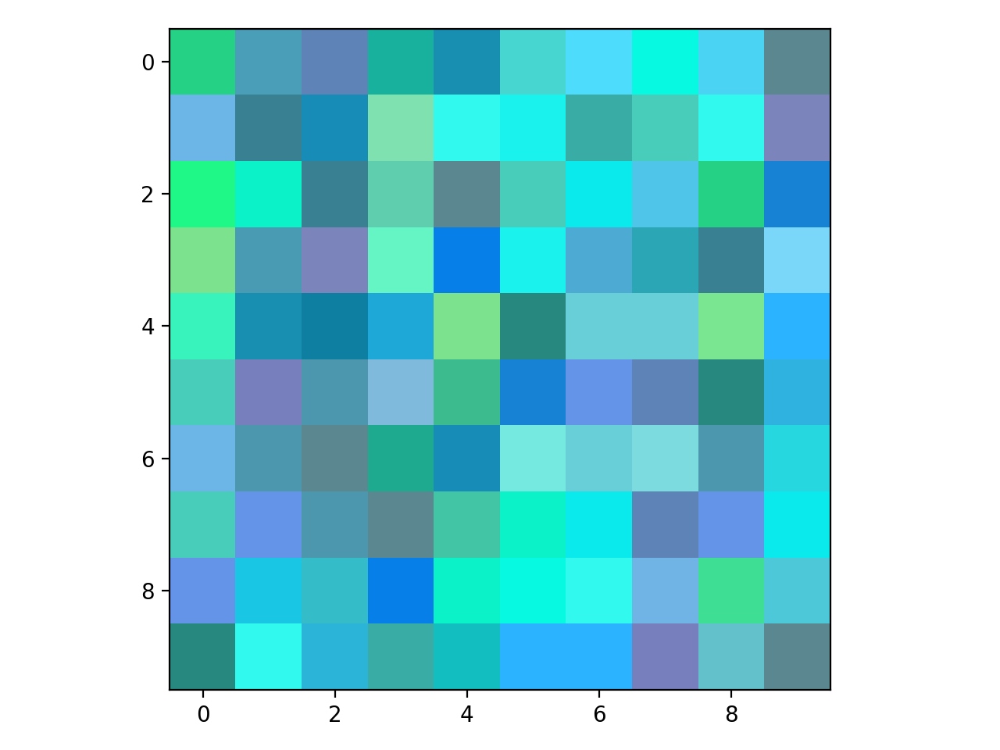

7. A color palette with the dark theme
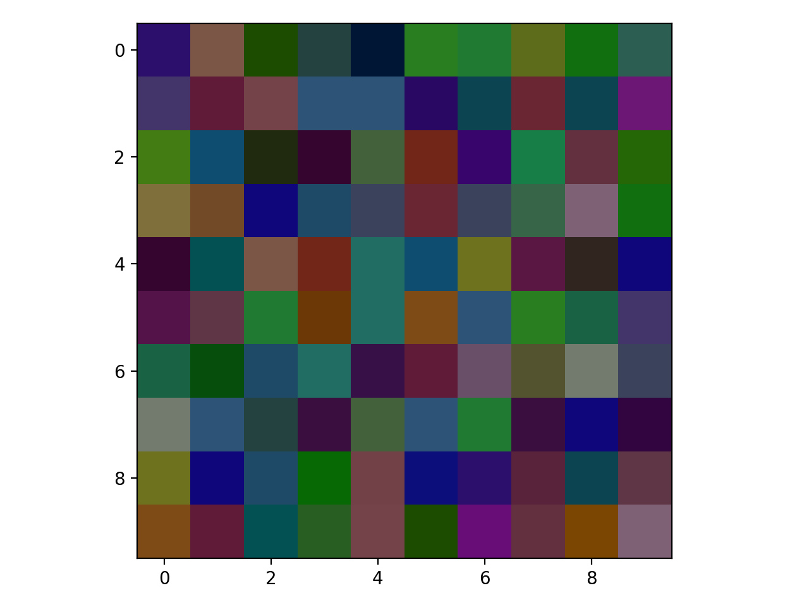

## Including Variance

The `variance` can be picked for colors with a given theme. The `variance` is a decimal between `0.0` and `1.0` where `0.0` would always return the same color as the input theme and `1.0` would return a completely random number disregarding the given theme. This is picked off a standard deviation.

1. A set of random colors with a given `white` theme and `variance=0.1`
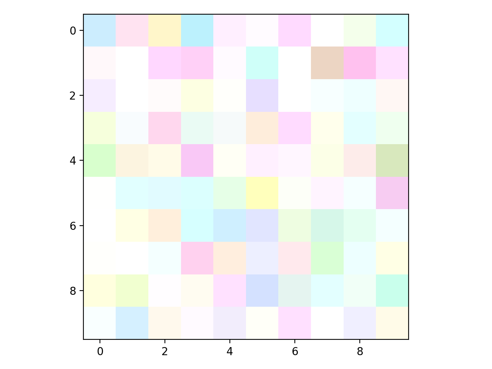

2. A set of random colors with a given `light blue rgb(100, 100, 255)` theme and `variance=0.1`
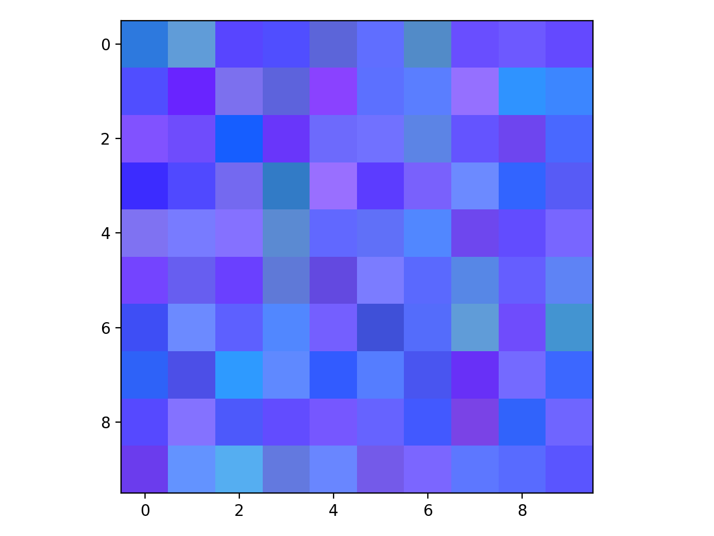

## Multiple Themes

You can also add multiple themes. 

1. An set of random colors that had both the themes from above as input and generated colors based on them.
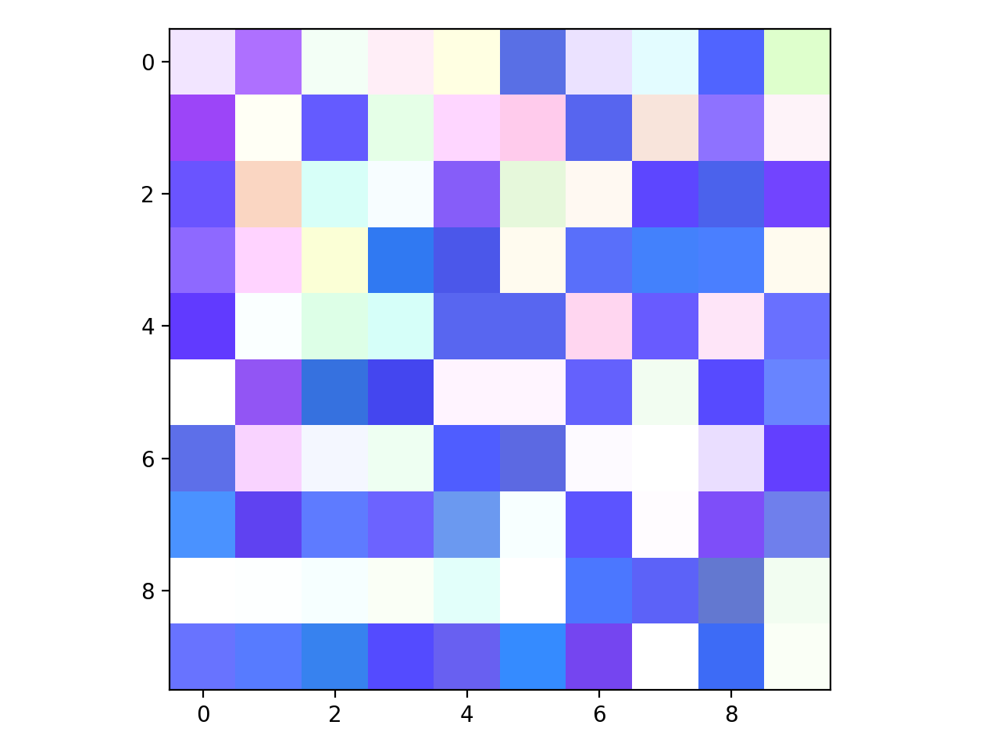

## Monochrome Colors

You can have monochrome colors with a field set constant.

1. To have only orange colors generated, you can pass `vary='green'` as a parameter to generate. This is with variance 0.1
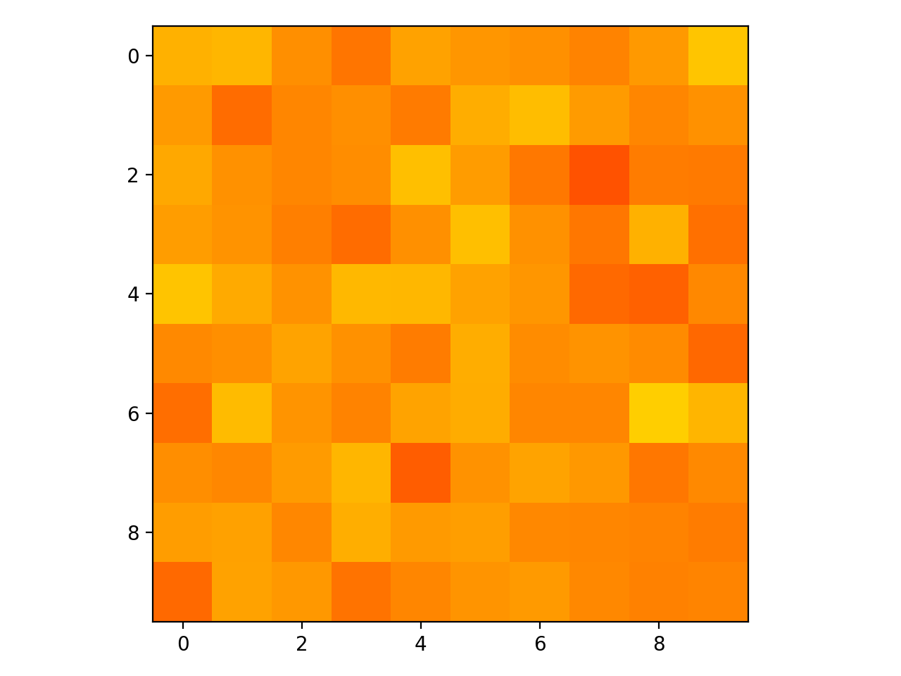

2. To have only orange colors generated, you can pass `vary='green'` as a parameter to generate. This is with variance 0.6
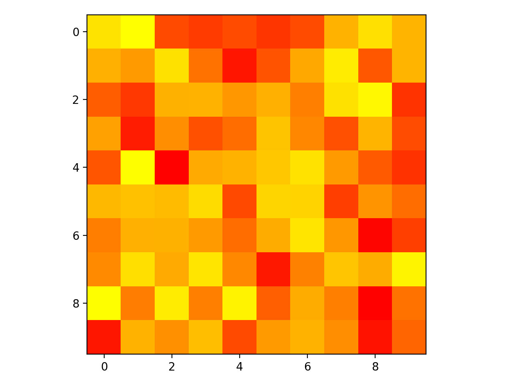
